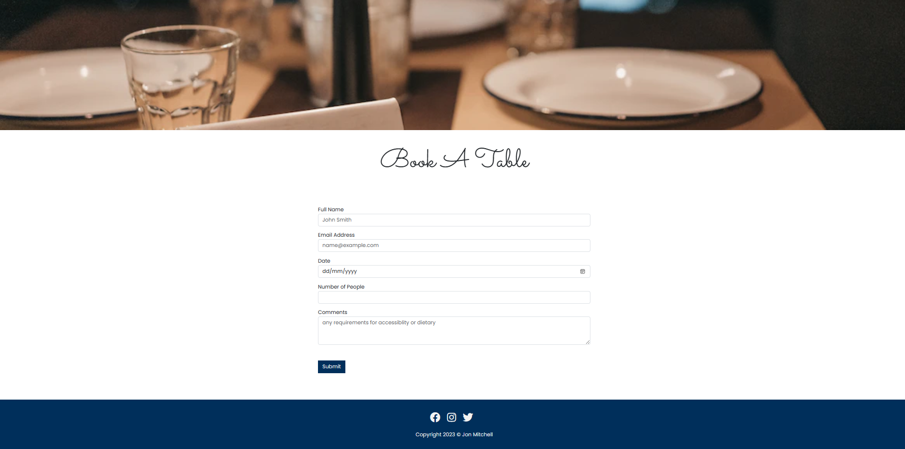

<h1 align="center">🍻 Ferox Bar & Grill 🥩</h1>

[View the live project here.](https://jonxmitchell.github.io/ferox-bar-grill)

[Am I Responsive?](https://ui.dev/amiresponsive?url=https://jonxmitchell.github.io/ferox-bar-grill)

Red Fox Bar & Grill website has been developed as the front and center for the business with a responsive and accessible design for a range of devices to ensure it provides a smooth experience for all visitors.

## Table of Contents

- [User Experience (UX)](<#User-Experience-(UX)>)
  - [Key Features of the Site](#Key-Features-of-the-Site)
  - [User Stories](#User-Stories)
    - [First Time User Goals](#First-Time-User-Goals)
    - [Clients User Goals](#Clients-User-Goals)
    - [Returning Users Goals](#Returning-Users-Goals)
- [Design](#Design)
  - [Colour Scheme](#Colour-Scheme)
  - [Typography](#Typography)
  - [Imagery](#Imagery)
  - [Features](#Features)
    - [Summary](#Summary)
    - [Home Page](#Home-Page)
    - [Gallery Page](#Gallery-Page)
    - [Table Booking Page](#Table-Booking-Page)
    - [Contact Us Page](#Contact-Us-Page)
    - [Future Features](#Future-Features)
- [Technologies Used](#Technologies-Used)
  - [Frameworks, Libraries, Programs & Web Apps Used](#Frameworks,-Libraries,-Programs-&-Web-Apps-Used)
- [Wireframes](#wireframes)
  - [Desktop Wireframe](#desktop-wireframe)
  - [Mobile Wireframe](#mobile-wireframe)
  - [Tablet Wireframe](#tablet-wireframe)
- [Implemented Features](#implemented-features)
  - [Features Across All Pages](#features-across-all-pages)
  - [Home Page Feature](#home-page-feature)
  - [Menu Feature](#menu-feature)
  - [Gallery Feature](#gallery-feature)
  - [Book A Table Feature](#book-a-table-feature)
  - [Contact Feature](#contact-feature)
  - [Response Feature](#response-feature)
- [Testing](#testing)
- [Deployment](#deployment)
  - [Github Pages](#github-pages)
  - [Local Deployment](#local-deployment)
  - [Gitpod](#gitpod)
- [Credits](#Credits)

## User Experience (UX)

Ferox Bar & Grill is a website to showcase the restaurant to potential customers. The site is built to make it a smooth experience for customers to find out what the serves in terms of their good and drinks, where to locate the restaurant and using its table booking feature.

### Key Features of the Site

- Showcase the restaurant.
- An always up to date menu.
- Easily display of information on how to locate the restaurant.
- An easy way for customers to make a table booking.
- User friendly way to contact the restaurant.
- Reviews from previous customers.

### User Stories

- #### First Time User Goals

  - Being a first time user of the site, I want to be able to obtain the information I need as quick and as efficiently as possible.
  - I would like to find reviews on the restaurant to have a good understanding if this is an establishment I want to visit and spend money at.
  - I want to be able to easily locate their social media to check their following to determine if this establishment can be trusted, also their instagram to see more photos of the restaurant and its food and drinks.
  - I want to be able to easily find out where the restaurant is located and how I can book a table with ease.

- #### Clients User Goals

  - As the client, I want to use the site to help bring more exposure to the business.
  - I want the site to display all the information they will need to make it a smooth experience for them.
  - An always up to date menu so customers know what we are serving.
  - Provide the users with a smooth table booking system so other resources are not used up within the business (eg. telephone table bookings require staff to answer the phone).

- #### Returning Users Goals
  - Check for changes within the menu.
  - Want to book another table for their return visit.
  - Write a review on their experience when they visited the restaurant.
  - Want to sign up to our newsletter for new updates in our menu or if the restaurant will be closed for any period.

## Design

### Colour Scheme

The colour scheme for this website has five colours which range from 3 shades of blue, one shade of grey and one a shade of white.

### Typography

Here are linked to the fonts that were used for this website and what their purpose was used for.

- [Sacramento](https://fonts.google.com/share?selection.family=Aboreto) is used for the first part of the logo "Ferox".
- [Aboreto](https://fonts.google.com/share?selection.family=Aboreto) is used for the second part of the logo "Bar & Grill".
- [Poppins](https://fonts.google.com/share?selection.family=Aboreto) is used for the the main body and general text displayed on the pages.

### Imagery

All images used in this website can be located below in [credits](Credits) below.

### Features

This website will have a range of pages which are all built with providing an easy and smooth experience for the customer and to add benefits to the client to allow them to redirect there resources that can be used else where.

- #### Summary
  - The website will be built to provide a completely responsive design where the elements on all the pages will be able to be displayed correctly on a range of devices from desktop to mobile.
  - The design throughout the website will be consistent through the colour scheme of the site and also the navigation and foot will remain the same throughout the website.
- #### Home Page
  - The home page will start off with a hero which will be a carousel slider to cycle through a range of photos of the restaurant.
  - Scrolling mid way down this page you will be greeted with a short about us piece of text about the restaurant.
  - Scrolling to the bottom of the page, you will be greeted by reviews thats previous customers have left about the restaurant.
- #### Gallery Page
  - This page will be a gallery of images of the business, its staff, their food and drink so customers will be able to get a better look into the restaurant.
- #### Table Booking Page
  - This page will be one section which will consist of a form where a customer will be able to arrange a booking of a table for when they would like to visit the restaurant and this will give a range of options of how the customer would like to book their table to their own needs.
- #### Contact Us Page
  - This will be a simple page where it will be a form for the customer to fill out to be able to ask any general enquires they may have.
  - This will also provide other contact details like the telephone number for the restaurant and also the location of the restaurant so customers can easily locate the restaurant.
- #### Future Features
  - In the future I would like to add some interaction / behavior features to the website, for example, I would like to use JavaScript make the forms on the page have event listeners so they are able to be used in more complex ways which can provide a better experience for the customer.
  - I would like to use an API to be able to pull reviews from a review website like TrustPilot to fill the reviews section on the website instead of having to keep manually updating them.

## Wireframes

The software used to create the wireframes is [Balsamiq Wireframes](hhttps://balsamiq.com/wireframes/).

### Desktop Wireframe

### Mobile Wireframe

### Mobile Wireframe

## Implemented Features

### Features Across All Pages

Throughout the whole website, one of the most common features used has been the Navigation Bar and the hero image section. These two features have been consistent throughout the website with only the hero image changing on each page. The navigation bar is fully responsive for desktop, mobile and tablet.

The second common feature throughout the website that has been consistent throughout all the pages is the footer section of the site. The footer has remained the same to provide a constant theme.

### Home Page Feature

The home page is the very first page that anyone will most likely land on. The purpose of this feature is to explain what the site is. You can use the navigation links to navigate the site as well as clear images and visible text and a button on the top half of the page to book a table. This page also shows some reviews of past customers.

### Menu Feature

The menu page is a great future of the website as the customers can see what food is being served. The menu is shown in categories which customers can click open to expand, this was chosen to work like this to keep the page nice and clean and free from clutter and showing only the information the customer wants.

### Gallery Feature

The gallery is a simple webpage on the site, it is just a collection of images of the restaurant to show what it looks like and what the food it serves also looks like to allow customers to get a good understanding of what to expect of they are to visit.

### Book A Table Feature

The table booking feature is a feature that can be used by customers to be able to book a table more easily to ask calling up to book a table and it will send a request straight to the restaurant who can then reply when they are able to within a timescale to confirm or decline the booking.

### Contact Feature

This page on the site was built for customers to be able to contact the restaurant about any sort of query they may have about it and the restaurant will be able to respond back to the member within a certain timescale. This page also provides more information on how to contact the restaurant and how to locate it.

### Response Feature

This is a simple page just to let you know once you have submitted a table booking or a message via the contact page that it has been sent successfully and the page will redirect you to the home page within 5 seconds.

## Testing

Throughout creating this website, there has been on-going testing to ensure all the features on the website are working as they should be. For all testing related documentation, please refer to the [Testing.md](./testing.md) file.

## Deployment

### Github Pages

This website was deployed to Github Pages and the steps in how it was deployed using this method are as follows.

1. Using this Github repository, locate the `Setting` button near the top right.
2. Select `Pages` on the left side.
3. Under `Branch`, select your `Master` branch and then select `/root` and click `Save`.

### Local Deployment

You are able to clone this repository by following the steps below.

1. Head to the [GitHub repository](https://github.com/jonxmitchell/ferox-bar-grill).
2. Find the button called `Code` located near the top right.
3. Select your preference of choice between HTTPS, SSH or Github CLI and copy the git clone link.
4. Open a terminal, change the root directory of where you would like to clone the project.
5. Paste the git clone link into your terminal and clone the project to your chosen directory.
   - `https://github.com/jonxmitchell/ferox-bar-grill`

### Gitpod

You can use Gitpod if you wish to clone this repository by clicking on the button below.

In order use this method with Gitpod, you will be required to have the browner extension installed. If you require assistance with setting it up, you can use this [link](https://www.gitpod.io/docs/configure/user-settings/browser-extension) to help.

## Technologies Used

### Frameworks, Libraries, Programs & Web Apps Used

- [Coolors](https://coolors.co/) was used to create my colour scheme. You can find my colour scheme [here](https://coolors.co/002f5b-004078-3e6385-a9a9a9-f3f3f3).
- [Shields.io](https://shields.io) was used to create my badges at the top of my readme.md.
- [HTML 5](https://html.spec.whatwg.org/multipage/) was used to create the website structure.
- [CSS 5](https://www.w3.org/TR/css-2022/) was used to style the website.
- [Bootstrap](https://getbootstrap.com/) was used to help speed up the website development speed.
- [Font Awesome](https://fontawesome.com/) was used for icons on the website.
- [Balsamiq Wireframes](https://balsamiq.com/wireframes/) was used to wireframe the website layout.

## Credits

For this section, it has been used to show a list of all the resources that I have used throughout building this project.

- [Shields.io](https://shields.io) - Created the badges on the ReadMe.md
- [readme.so](https://readme.so/) - Helping assist me to create my readme file.
- [Google Fonts](https://fonts.google.com/) - Provided the fonts used in the website.
- [Usplash Image - Adrien Olichon](https://unsplash.com/photos/ZgREXhl8ER0) - Used for home page hero image.
- [Usplash Image - IMattSmart](https://unsplash.com/photos/6PVeoAgWJwE) - Used for home page service one image.
- [Usplash Image - Joseph Gonzalez](https://unsplash.com/photos/fdlZBWIP0aM) - Used for home page service two image.
- [Usplash Image - Jonathan Borba](https://unsplash.com/photos/uB7q7aipU2o) - Used for home page service three image.
- [Usplash Image - Ben Black](https://unsplash.com/photos/fydJtvAdeas) - Used for home page service four image.
- [Usplash Image - Jake Nackos](https://unsplash.com/photos/IF9TK5Uy-KI) - Used for review one user image on home page.
- [Usplash Image - Jurica Koletić](https://unsplash.com/photos/7YVZYZeITc8) - Used for review two user image on home page.
- [Usplash Image - Henrique Castilho](https://unsplash.com/photos/L8kMx3rzt7s) - Used for review three user image on home page.
- [Usplash Image - Lidye](https://unsplash.com/photos/1Shk_PkNkNw) - Used for the hero image on the menu page.
- [Usplash Image - Sandra Seitamaa](https://unsplash.com/photos/OFJGlG3sKik) - Used for the hero image on the contact page.
- [Usplash Image - Albert](https://unsplash.com/photos/YYZU0Lo1uXE) - Used for hero image on the gallery page.
- [Usplash Image - Edward Howell](https://unsplash.com/photos/vvUy1hWVYEA) - Used for hero image on the response page.
- [Usplash Image - Siyuan](https://unsplash.com/photos/vvUy1hWVYEA) - Used for hero image on the contact page.
- [Usplash Image - Dinesh Ramaswamy](https://unsplash.com/photos/p-sEkj6-hAM) - Used in the gallery page.
- [Usplash Image - Francisco Suarez](https://unsplash.com/photos/0EkWTSFXwCc) - Used in the gallery page.
- [Usplash Image - Sebastian Coman Photography](https://unsplash.com/photos/eBmyH7oO5wY) - Used in the gallery page.
- [Usplash Image - Jay Wennington](https://unsplash.com/photos/N_Y88TWmGwA) - Used in the gallery page.
- [Usplash Image - Eugene](https://unsplash.com/photos/Xk0jQPZseMk) - Used in the gallery page.
- [Usplash Image - Kyle Head](https://unsplash.com/photos/PW8K-W-Kni0) - Used in the gallery page.
- [Usplash Image - Hitesh Dewasi](https://unsplash.com/photos/5JwBbnyZzfc) - Used in the book a table page.
- [Google Maps](https://maps.google.co.uk/) - Used to embed a map location into my contact page.
- [Am I Responsive?](https://ui.dev/amiresponsive) - Used to create the device mock up in the read me file.
- [Stackoverflow](https://stackoverflow.com/) - Used to help with research and understanding certain concepts and code.
- [Font Awesome](https://fontawesome.com/) - Used to add icons to parts of the website.
- [W3Schools](https://www.w3schools.com/) - Used to research certain HTML tags and CSS syntax.
- [MDM Web Docs](https://developer.mozilla.org/en-US/docs/Web/HTML) - Used for research HTML tags for syntax explanations.
- [MDBootstrap - Static images](https://mdbootstrap.com/docs/standard/extended/gallery/) - Used to help create the layout for the gallery on the gallery page.
- [W3C HTML Validator](https://validator.w3.org/) - Used to help validate my HTML code on all pages.
- [W3C CSS Validator](https://jigsaw.w3.org/css-validator/) - Used to help validate my CSS code.