# Testing

In this file, you will see the documentation that I have put together throughout the time of creating this website. This will go over any errors that were encourted if any and also checking to ensure that the code valid by running it through code validators.

## Code Validation

This section will show how well the code has performed within code validators.

### HTML

I have decided to use the [W3C HTML Validator](https://validator.w3.org/) to check if my HTML code is valid. Please see the below table with the results.

| Page   | Screenshot | Notes |
| ------ |  ---------- | ----- |
| Home Page (index.html) |  |  Passed |
| Menu Page (menu.html) |  |  Passed |
| Gallery Page (gallery.html) |  |  Passed |
| Book A Table Page (tablebooking.html) |  |  Passed |
| Contact Page (contact.html) |  |  Passed |
| Response Page (response.html) |  |  Passed |

### CSS

I have decided to use the [W3C CSS Validator](https://jigsaw.w3.org/css-validator/validator) to check if my CSS code is valid. Please see the below table with the results.

| File   | Screenshot | Notes |
| ------ |  ---------- | ----- |
| CSS File (style.css) | 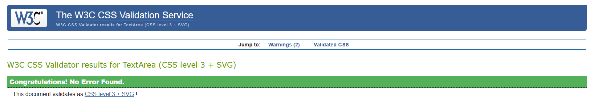 |  Passed |

## Browser Compatibility

Here I have chosen to test how the site works across 4 of the biggest browsers available. As I do not have access to a MacBook or a device that can run the latest version of Apple's Safari browser, I am unable to test the site on that browser. The site has been tested on Microsoft Edge, Google Chrome, Opera and Firefox.

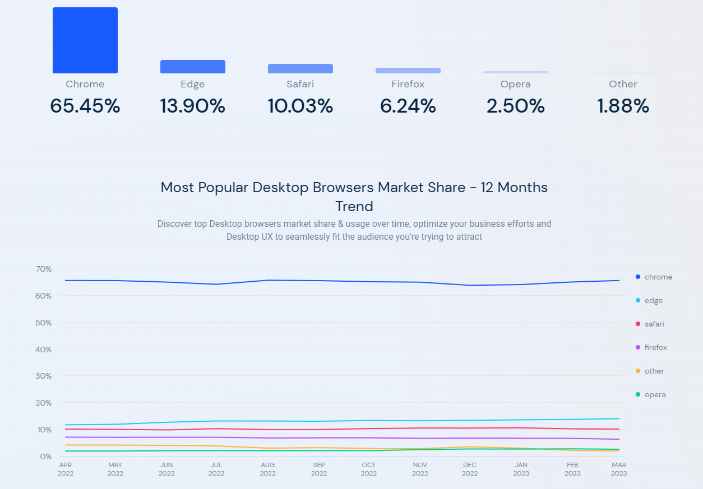

| Browser   | Screenshot | Notes |
| ------ |  ---------- | ----- |
| Microsoft Edge | 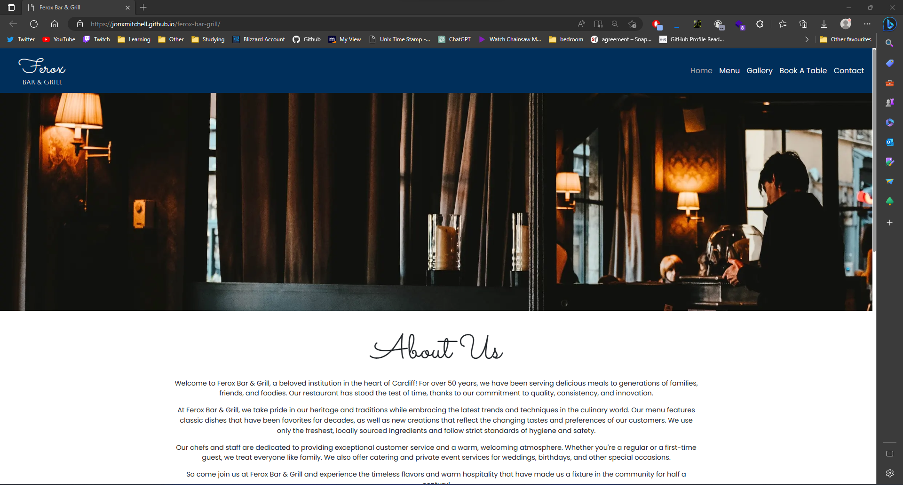 |  Passed, no issues were found |
| FireFox |  |  Passed, no issues were found |
| Chrome | 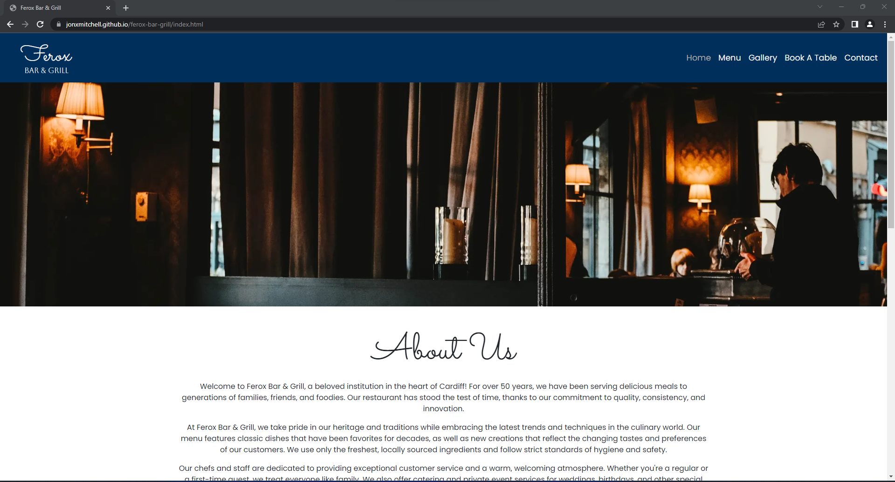 |  Passed, no issues were found |
| Opera | 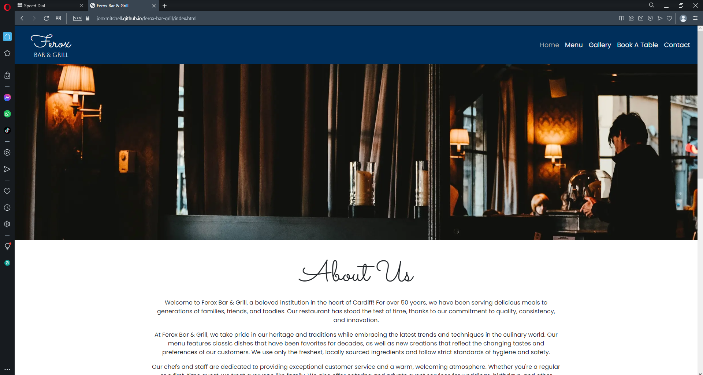 |  Passed, no issues were found |

## Accessibility Accessibility

Accessibility on the web is important to make sure we accommodate for everyone who tries to access our site to ensure they can have a smooth experience and get the information or action they need. To test the accessibility of the website, I have used [Web Accessibility Evaluation Tool (WAVE)](https://wave.webaim.org/).

| Page   | Screenshot | Notes |
| ------ |  ---------- | ----- |
| Home Page (index.html) | 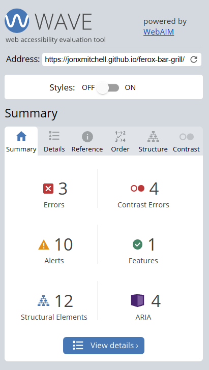 |  Errors found, corrected the alt text on images, however, I contrast errors are not needed to be corrected, alerts can be ignored. |
| Menu (menu.html) | 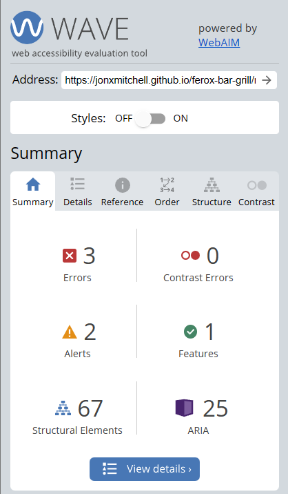 |  Errors found, fixed linking to same page in navbar links, blank links in footer can be ignored, alerts can be ignored. |
| Book A Table (tablebooking.html) | 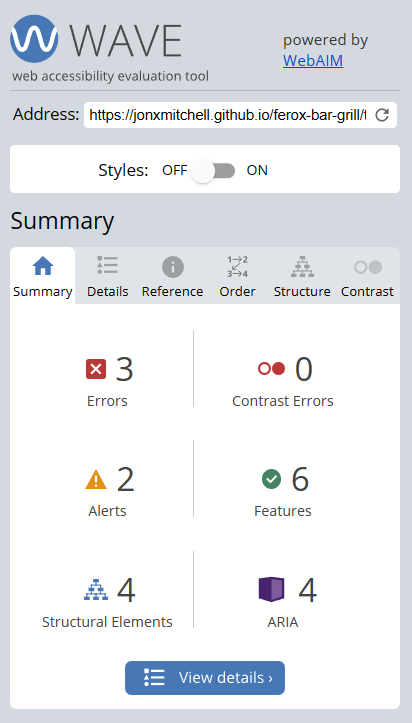 |  Errors found, fixed linking to same page in navbar links, blank links in footer can be ignored as the text are icons with links to external sites, alerts can be ignored. |
| Gallery (gallery.html) | 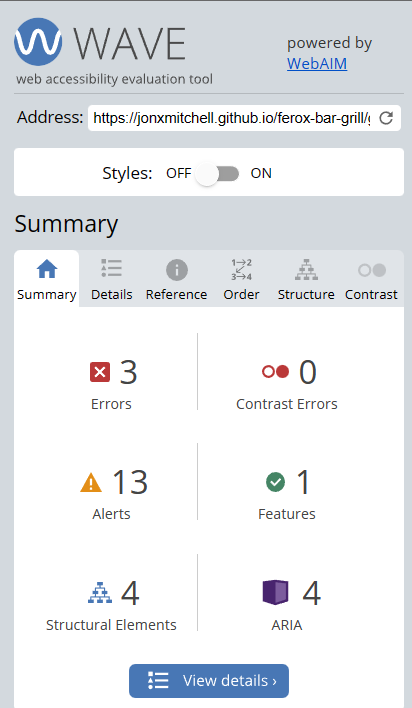 |  Errors found, fixed linking to same page in navbar links, blank links in footer can be ignored as the text are icons with links to external sites, alerts can be ignored. |
| Contact (contact.html) | 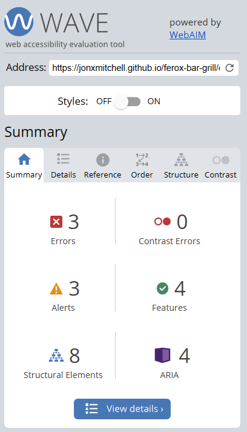 |  Errors found, fixed linking to same page in navbar links, blank links in footer can be ignored as the text are icons with links to external sites, alerts can be ignored. |
| Response (response.html) |  |  Errors found, blank links in footer can be ignored as the text are icons with links to external sites, error with the redirect can be ignored as this is the purpose of the page is to redirect you after 5 seconds as soon as you join it, alerts can be ignored. |

## Lighthouse Analyzing  

I have used the Lighthouse feature within the Microsoft Edge browser to help get a good idea on the scoring of how the site performs on each page on mobile and desktop versions of the site.

| Page   | Screenshot | Format | Notes |
| ------ |  ---------- | ----- |----- |
| Home Page (index.html) | 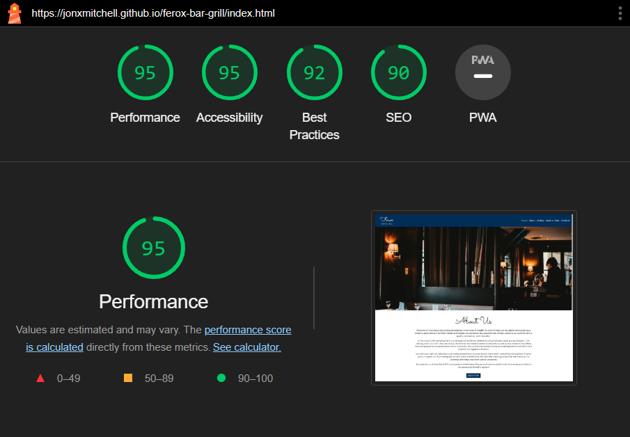 |  Desktop  |   Passed with an overall score of 95%  |
| Home Page (index.html) | 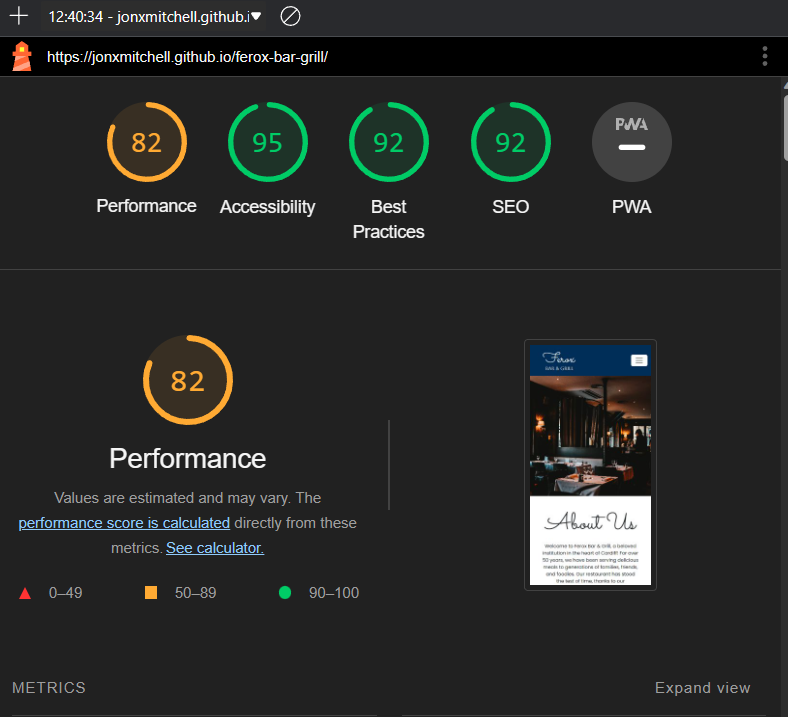 |  Mobile  |   Scored an 82% due to the issue being with image sizes, this can be fixed by compressing images to be smaller in size to.  |
| Menu Page (menu.html) | 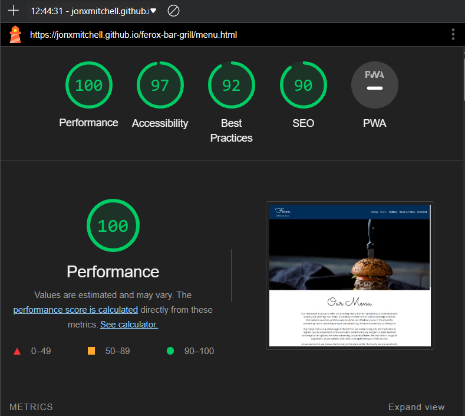 |  Desktop  |   Passed  |
| Menu Page (menu.html) | 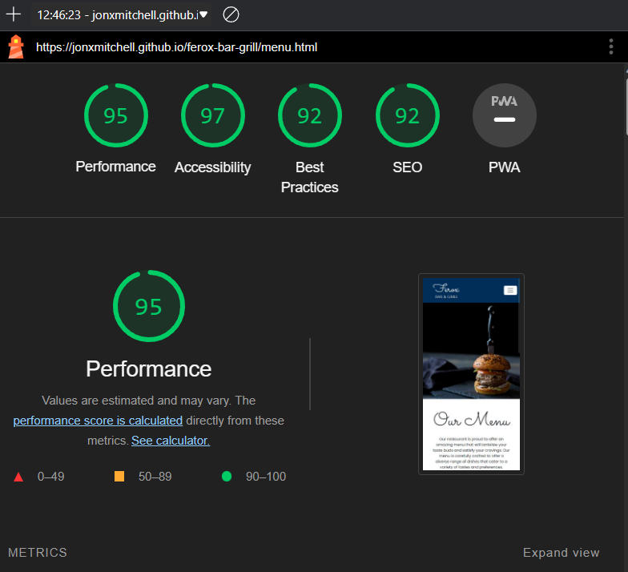 |  Mobile  |   Passed  |
| Gallery Page (gallery.html) | 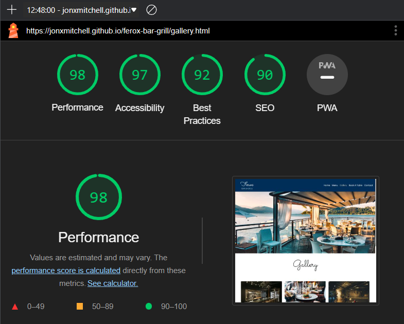 |  Desktop  |   Passed  |
| Gallery Page (gallery.html) | 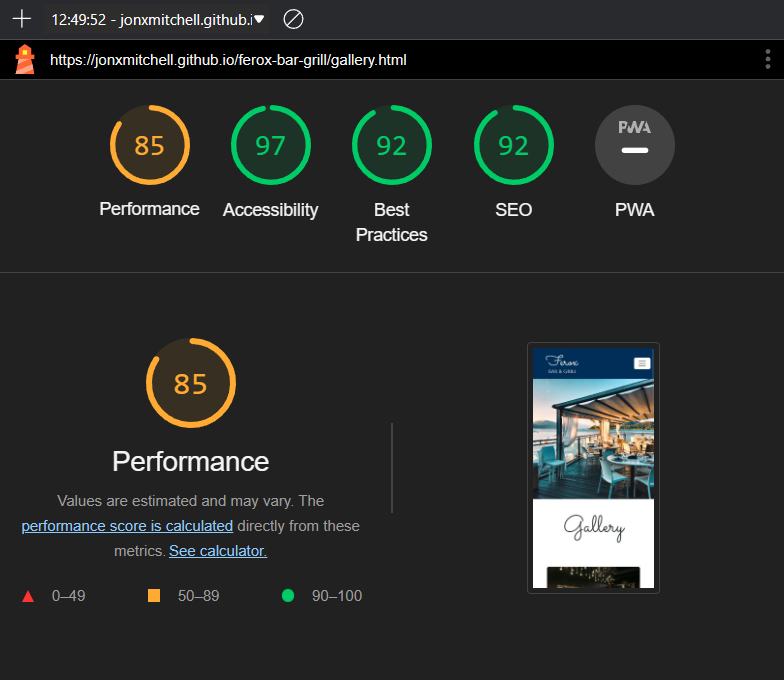 |  Mobile  |   Scored 85% on performance due to the size in the image, these can be better optimized by compressing the images down to a smaller size.  |
| Book A Table Page (tablebooking.html) | 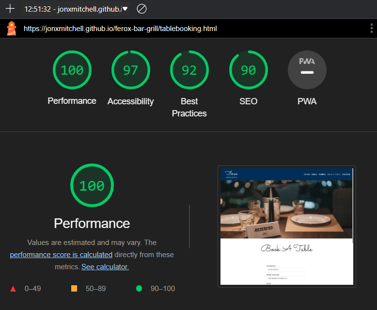 |  Desktop  | Passed  |
| Book A Table Page (tablebooking.html) | 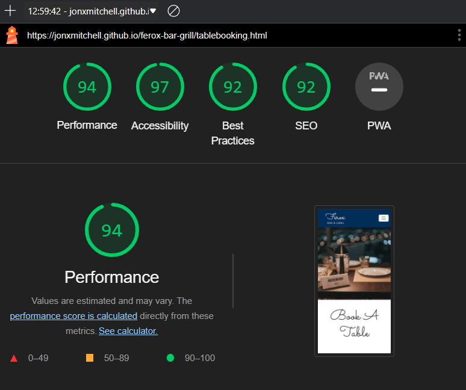 |  Mobile  | Passed  |
| Contact Page (contact.html) | 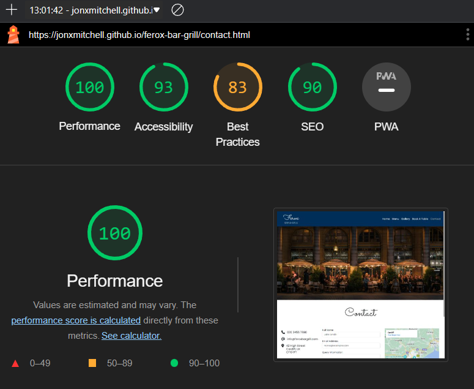 |  Desktop  | Passed, however best practices with scored 83% due to the google maps console logging errors from the embed. |
| Contact Page (contact.html) | 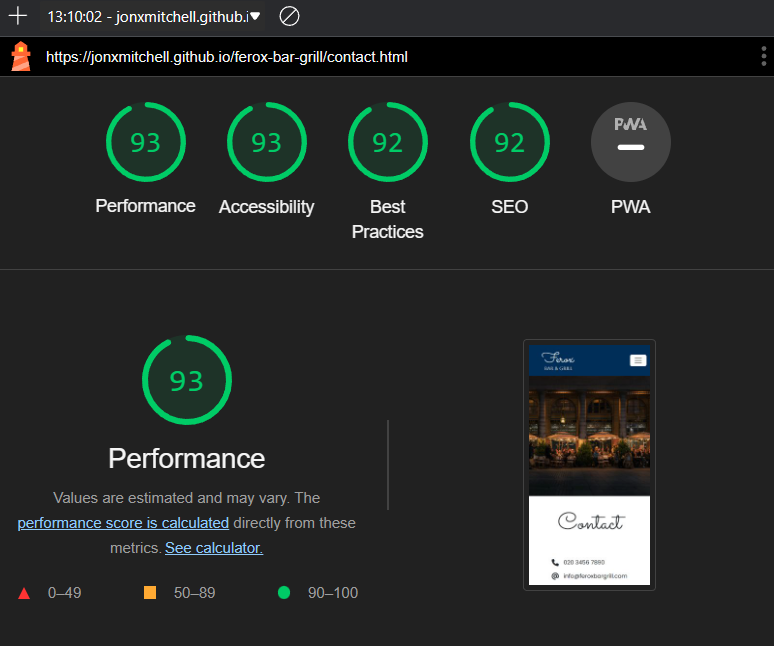 |  Mobile  | Passed |
| Response Page (response.html) |  |  Desktop  | Passed, 83% scored on accessibility due to the refresh feature but that is intended and the user is aware as it explains in the message on the page. |
| Response Page (response.html) |  |  Mobile  | Passed |

## Responsiveness

Below you will see the examples of how well the site performance on different device resolutions.

 iPhone 12 Pro (Microsoft Edge Dev Tools)

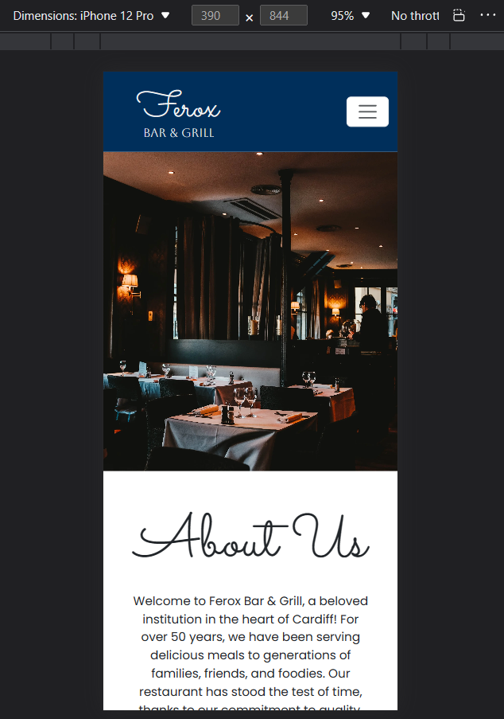

| Page | Result |
| --- | --- |
| Home | ✅ Passed |
| Menu | ✅ Passed |
| Gallery | ✅ Passed |
| Book A Table | ✅ Passed |
| Contact | ✅ Passed |
| Response | ✅ Passed|

 Samsung Galaxy 8+ (Microsoft Edge Dev Tools)

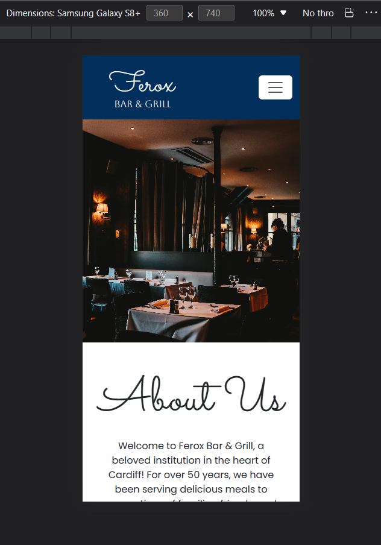

| Page | Result |
| --- | --- |
| Home | ✅ Passed |
| Menu | ✅ Passed |
| Gallery | ✅ Passed |
| Book A Table | ✅ Passed |
| Contact | ✅ Passed |
| Response | ✅ Passed|

 Samsung Galaxy 20 Ultra (Microsoft Edge Dev Tools)

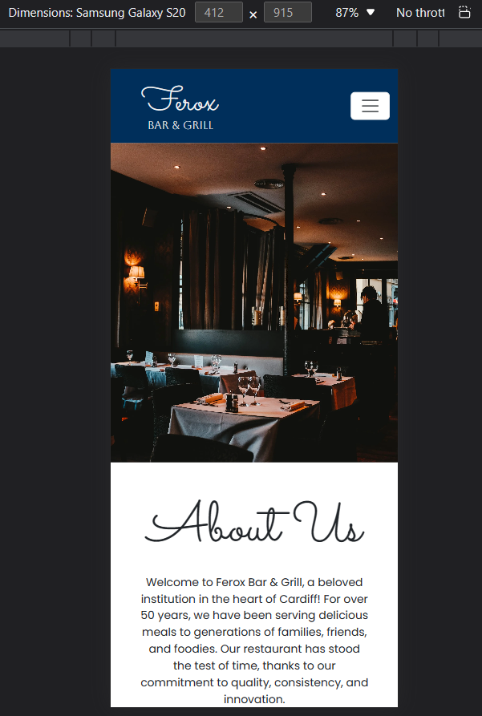

| Page | Result |
| --- | --- |
| Home | ✅ Passed |
| Menu | ✅ Passed |
| Gallery | ✅ Passed |
| Book A Table | ✅ Passed |
| Contact | ✅ Passed |
| Response | ✅ Passed|

 iPad Air (Microsoft Edge Dev Tools)

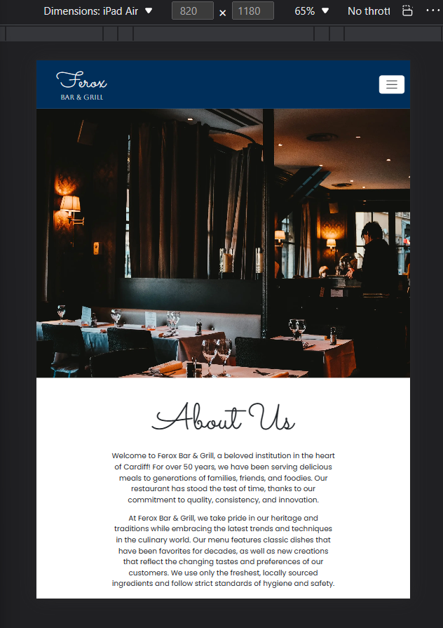

| Page | Result |
| --- | --- |
| Home | ✅ Passed |
| Menu | ✅ Passed |
| Gallery | ✅ Passed |
| Book A Table | ✅ Passed |
| Contact | ✅ Passed |
| Response | ✅ Passed|

 Surface Pro 7 (Microsoft Edge Dev Tools)

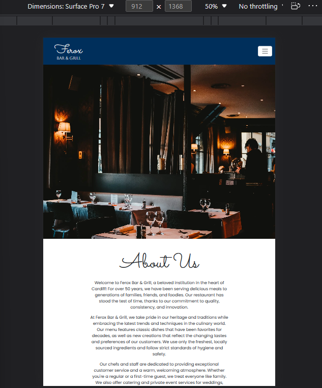

| Page | Result |
| --- | --- |
| Home | ✅ Passed |
| Menu | ✅ Passed |
| Gallery | ✅ Passed |
| Book A Table | ✅ Passed |
| Contact | ✅ Passed |
| Response | ✅ Passed|

 Surface Duo (Microsoft Edge Dev Tools)

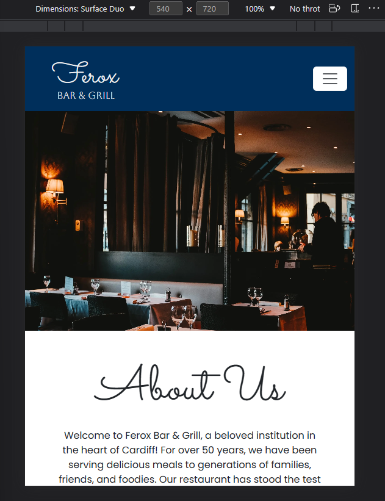

| Page | Result |
| --- | --- |
| Home | ✅ Passed |
| Menu | ✅ Passed |
| Gallery | ✅ Passed |
| Book A Table | ✅ Passed |
| Contact | ✅ Passed |
| Response | ✅ Passed|

 Samsung Galaxy A51/71 (Microsoft Edge Dev Tools)

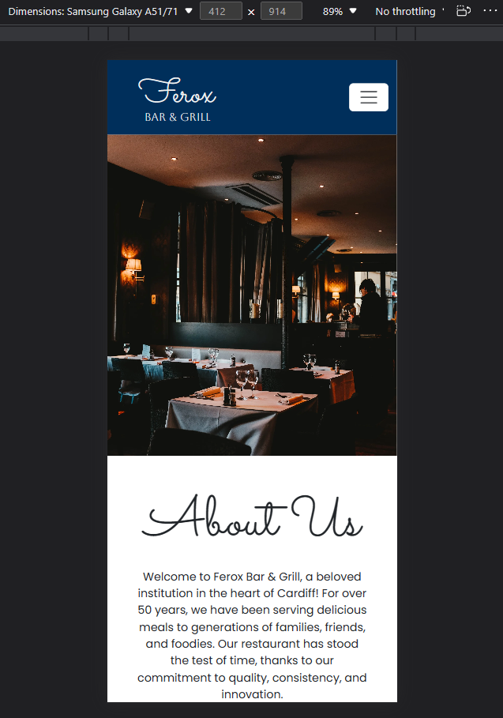

| Page | Result |
| --- | --- |
| Home | ✅ Passed |
| Menu | ✅ Passed |
| Gallery | ✅ Passed |
| Book A Table | ✅ Passed |
| Contact | ✅ Passed |
| Response | ✅ Passed|

 Nest Hub Max (Microsoft Edge Dev Tools)

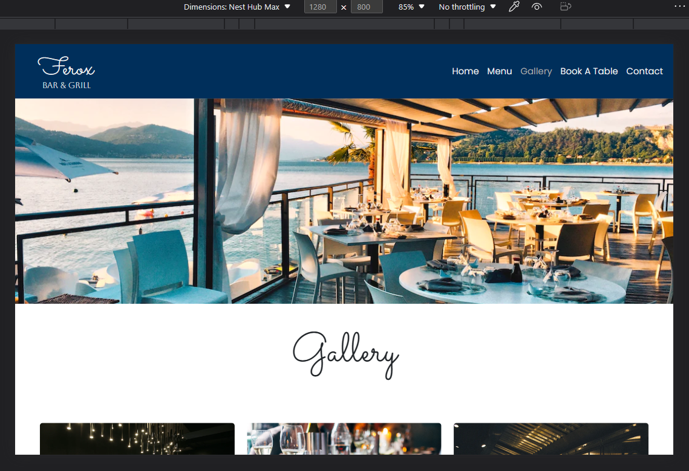

| Page | Result |
| --- | --- |
| Home | ✅ Passed |
| Menu | ✅ Passed |
| Gallery | ✅ Passed |
| Book A Table | ✅ Passed |
| Contact | ✅ Passed |
| Response | ✅ Passed|

## User Stories

### New User

| User Story | Website Functionality |Screenshot |
| --- | --- |--- |
| The user would like to know what the site is for | As soon as the customer visits the site, they are most likely going to land on the home page and it will explain in the logo that it is a bar and grill, the hero image shows an image of the restaurant and also you see some text about the business and further down you can see the values of the business and also reviews from other customers.  |  |
| The user would like to search the website and find out what is available with ease. | The website is built to be able to navigate it quick easily with the navbar being consistent throughout the site on all 5 pages. | 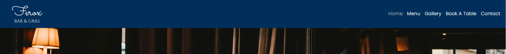 |
| The user would like to be able to find the menu for the restaurant straight away.  | The user as soon as they land on any page, they are able to check the NavBar and be able to navigate straight to the menu on the site and see what is available. | 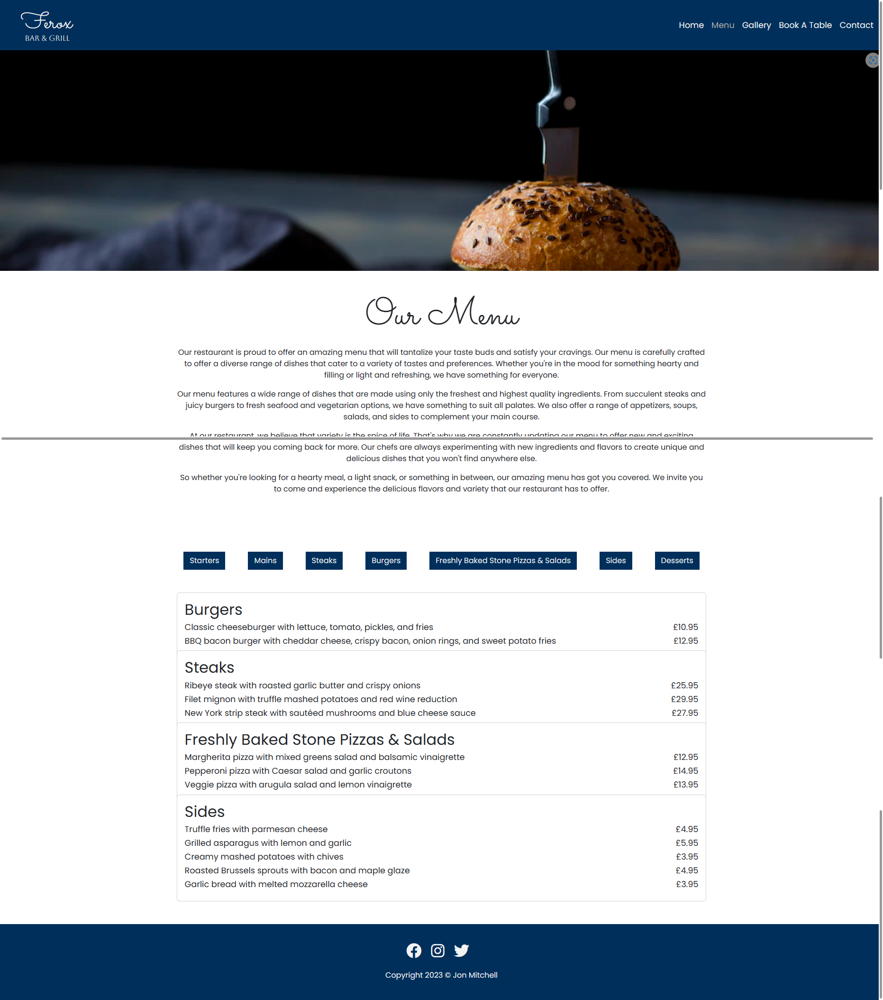 | 
| The user is wanting to be able to book a table with ease.  | The user is able to get to the table booking page with ease by following the link on the navbar and then fill in the table booking form. | 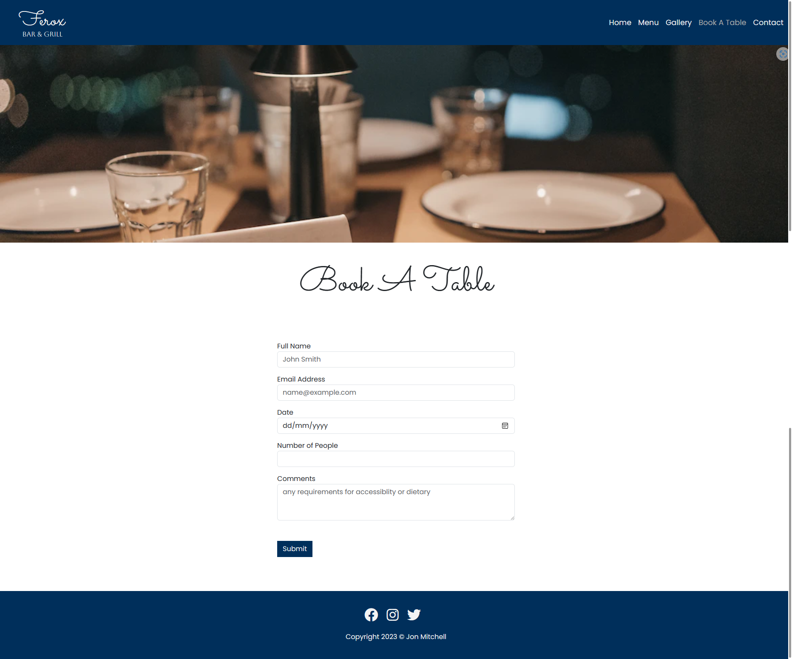 | 
| The user would like to be able to submit a question to the restaurant before visiting it | The user can click on the contact nav link at the top of the page and submit any type question/query they have. | 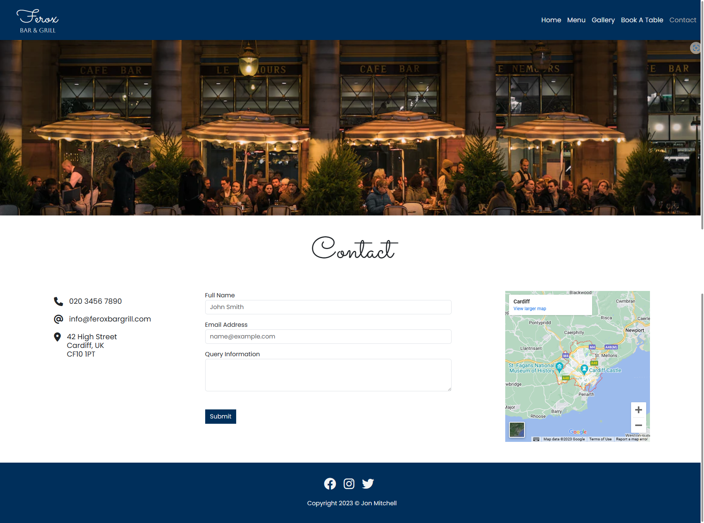 |

### Returning User

| User Story | Website Functionality |Screenshot / notes |
| --- | --- |--- |
| The user would like to follow the restaurant on social media | The user can look at the footer on each page and find the social icons which will open a new table to the restaurant's social media pages. |  |
| The user would like to be able to see if there is any changes to menu since they last visited | The site can be updated to show this information by adding a date and time of when the menu was last adjusted so the user can find out quicker if the menu updated without having to check the menu | This future is planned to be built out on the menu page to provide a better experience for the returning users. |

### Site Administrator / Client

| User Story | Website Functionality |Screenshot / notes |
| --- | --- |--- |
| The client would like to be able to update the site easily in the future incase they need to update the sites information like the menu for example | The site is easily updatable as a lot of the code is clearly labelled with comments throughout which explains what each section is used for. | 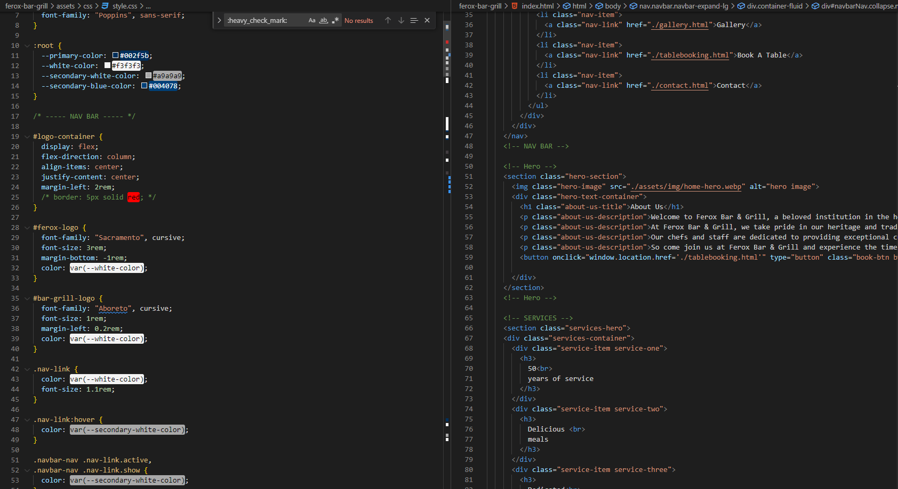 |
|The client would expect that the contact form would require all the necessary information is filled out before it is submitted. | The contact and book a table page on the site both contain forms and they are both using the correct syntax on the HTML elements to make sure the user filling out the form cannot submit it before all the required information is filled out and filled out also correctly. | 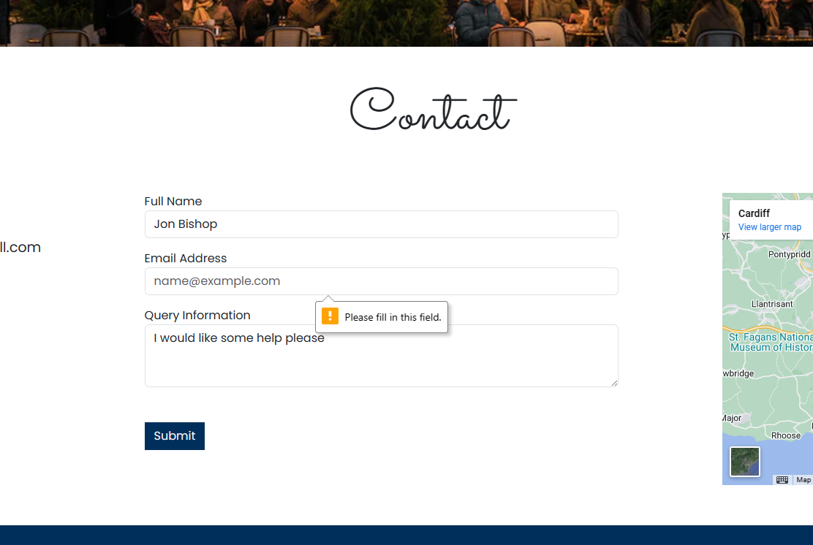 |

## Remaining Bugs

After completing all of the tests that were carried out above, there are no further bugs that I am aware of for this website.