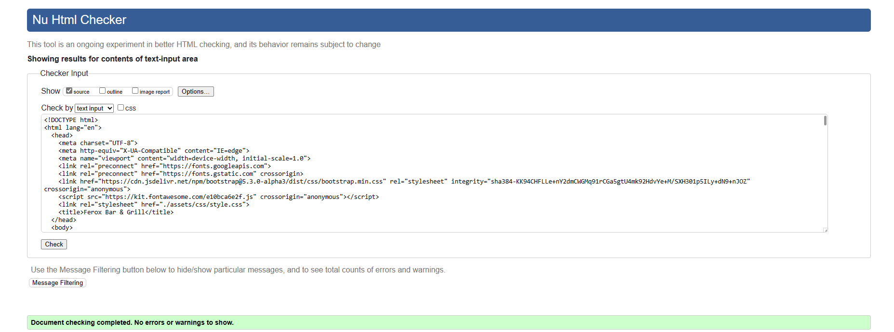
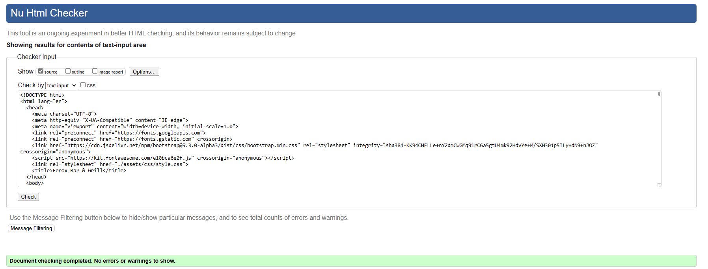
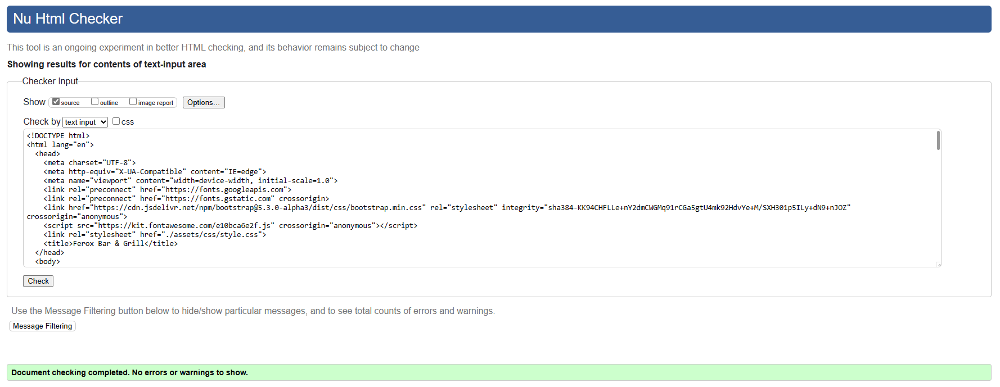
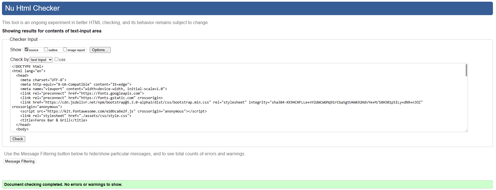

# Testing

In this file, you will see the documentation that I have put together throughout the time of creating this website. This will go over any errors that were encourted if any and also checking to ensure that the code valid by running it through code validators.

## Code Validation

This section will show how well the code has performed within code validators.

### HTML

I have decided to use the [W3C Validator](https://validator.w3.org/) to check if my HTML code is valid. Please see the below table with the results.

| Page   | Screenshot | Notes |
| ------ |  ---------- | ----- |
| Home Page (index.html) |  |  Passed |
| Menu Page (menu.html) |  |  Passed |
| Gallery Page (gallery.html) |  |  Passed |
| Book A Table Page (tablebooking.html) |  |  Passed |
| Contact Page (tablebooking.html) |  |  Passed |
| Response Page (response.html) |  |  Passed |
