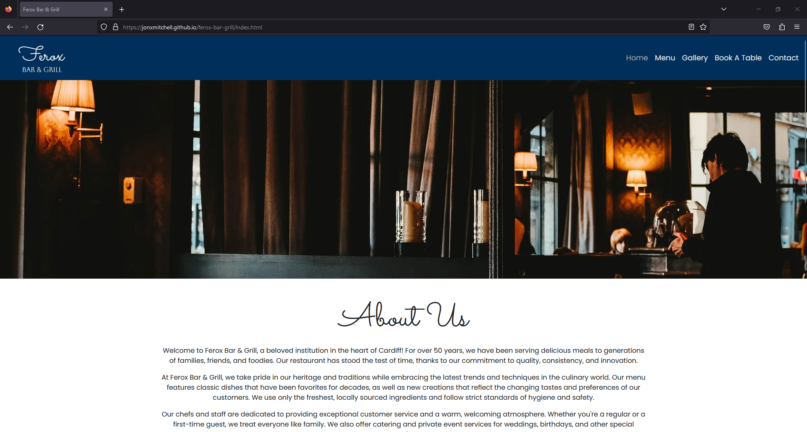

# Testing

In this file, you will see the documentation that I have put together throughout the time of creating this website. This will go over any errors that were encourted if any and also checking to ensure that the code valid by running it through code validators.

## Code Validation

This section will show how well the code has performed within code validators.

### HTML

I have decided to use the [W3C HTML Validator](https://validator.w3.org/) to check if my HTML code is valid. Please see the below table with the results.

| Page   | Screenshot | Notes |
| ------ |  ---------- | ----- |
| Home Page (index.html) |  |  Passed |
| Menu Page (menu.html) |  |  Passed |
| Gallery Page (gallery.html) |  |  Passed |
| Book A Table Page (tablebooking.html) |  |  Passed |
| Contact Page (contact.html) |  |  Passed |
| Response Page (response.html) |  |  Passed |

### CSS

I have decided to use the [W3C CSS Validator](https://jigsaw.w3.org/css-validator/validator) to check if my CSS code is valid. Please see the below table with the results.

| File   | Screenshot | Notes |
| ------ |  ---------- | ----- |
| CSS File (style.css) |  |  Passed |

## Browser Compatibility

Here I have chosen to test how the site works across 4 of the biggest browsers available. As I do not have access to a MacBook or a device that can run the latest version of Apple's Safari browser, I am unable to test the site on that browser. The site has been tested on Microsoft Edge, Google Chrome, Opera and Firefox.

| Browser   | Screenshot | Notes |
| ------ |  ---------- | ----- |
| Microsoft Edge |  |  Passed, no issues were found |
| FireFox |  |  Passed, no issues were found |
| Chrome |  |  Passed, no issues were found |
| Opera |  |  Passed, no issues were found |

## Accessibility Accessibility

Accessibility on the web is important to make sure we accommodate for everyone who tries to access our site to ensure they can have a smooth experience and get the information or action they need. To test the accessibility of the website, I have used [Web Accessibility Evaluation Tool (WAVE)](https://wave.webaim.org/).

| Page   | Screenshot | Notes |
| ------ |  ---------- | ----- |
| Home Page (index.html) |  |  Errors found, corrected the alt text on images, however, I contrast errors are not needed to be corrected, alerts can be ignored. |
| Menu (menu.html) |  |  Errors found, fixed linking to same page in navbar links, blank links in footer can be ignored, alerts can be ignored. |
| Book A Table (tablebooking.html) |  |  Errors found, fixed linking to same page in navbar links, blank links in footer can be ignored as the text are icons with links to external sites, alerts can be ignored. |
| Gallery (gallery.html) |  |  Errors found, fixed linking to same page in navbar links, blank links in footer can be ignored as the text are icons with links to external sites, alerts can be ignored. |
| Contact (contact.html) |  |  Errors found, fixed linking to same page in navbar links, blank links in footer can be ignored as the text are icons with links to external sites, alerts can be ignored. |
| Response (contact.html) |  |  Errors found, blank links in footer can be ignored as the text are icons with links to external sites, error with the redirect can be ignored as this is the purpose of the page is to redirect you after 5 seconds as soon as you join it, alerts can be ignored. |

## Lighthouse Analyzing  

I have used the Lighthouse feature within the Microsoft Edge browser to help get a good idea on the scoring of how the site performs on each page on mobile and desktop versions of the site.

| Page   | Screenshot | Format | Notes |
| ------ |  ---------- | ----- |----- |
| Home Page (index.html) |  |  Desktop  |   Passed with an overall score of 95%  |
| Home Page (index.html) |  |  Mobile  |   Scored an 82% due to the issue being with image sizes, this can be fixed by compressing images to be smaller in size to.  |
| Menu Page (menu.html) |  |  Desktop  |   Passed  |
| Menu Page (menu.html) |  |  Mobile  |   Passed  |
| Gallery Page (gallery.html) |  |  Desktop  |   Passed  |
| Gallery Page (gallery.html) |  |  Mobile  |   Scored 85% on performance due to the size in the image, these can be better optimized by compressing the images down to a smaller size.  |
| Book A Table Page (tablebooking.html) |  |  Desktop  | Passed  |
| Book A Table Page (tablebooking.html) |  |  Mobile  | Passed  |
| Contact Page (contact.html) |  |  Desktop  | Passed, however best practices with scored 83% due to the google maps console logging errors from the embed. |
| Contact Page (contact.html) |  |  Mobile  | Passed |

## Responsiveness

Below you will see the examples of how well the site performance on different device resolutions.

 iPhone 12 Pro (Microsoft Edge Dev Tools)

| Page | Result |
| --- | --- |
| Home | ✅ Passed |
| Menu | ✅ Passed |
| Gallery | ✅ Passed |
| Book A Table | ✅ Passed |
| Contact | ✅ Passed |
| Response | ✅ Passed|

 Samsung Galaxy 8+ (Microsoft Edge Dev Tools)

| Page | Result |
| --- | --- |
| Home | ✅ Passed |
| Menu | ✅ Passed |
| Gallery | ✅ Passed |
| Book A Table | ✅ Passed |
| Contact | ✅ Passed |
| Response | ✅ Passed|

 Samsung Galaxy 20 Ultra (Microsoft Edge Dev Tools)

| Page | Result |
| --- | --- |
| Home | ✅ Passed |
| Menu | ✅ Passed |
| Gallery | ✅ Passed |
| Book A Table | ✅ Passed |
| Contact | ✅ Passed |
| Response | ✅ Passed|

 iPad Air (Microsoft Edge Dev Tools)

| Page | Result |
| --- | --- |
| Home | ✅ Passed |
| Menu | ✅ Passed |
| Gallery | ✅ Passed |
| Book A Table | ✅ Passed |
| Contact | ✅ Passed |
| Response | ✅ Passed|

 Surface Pro 7 (Microsoft Edge Dev Tools)

| Page | Result |
| --- | --- |
| Home | ✅ Passed |
| Menu | ✅ Passed |
| Gallery | ✅ Passed |
| Book A Table | ✅ Passed |
| Contact | ✅ Passed |
| Response | ✅ Passed|

 Surface Duo (Microsoft Edge Dev Tools)

| Page | Result |
| --- | --- |
| Home | ✅ Passed |
| Menu | ✅ Passed |
| Gallery | ✅ Passed |
| Book A Table | ✅ Passed |
| Contact | ✅ Passed |
| Response | ✅ Passed|

 Samsung Galaxy A51/71 (Microsoft Edge Dev Tools)

| Page | Result |
| --- | --- |
| Home | ✅ Passed |
| Menu | ✅ Passed |
| Gallery | ✅ Passed |
| Book A Table | ✅ Passed |
| Contact | ✅ Passed |
| Response | ✅ Passed|

 Nest Hub Max (Microsoft Edge Dev Tools)

| Page | Result |
| --- | --- |
| Home | ✅ Passed |
| Menu | ✅ Passed |
| Gallery | ✅ Passed |
| Book A Table | ✅ Passed |
| Contact | ✅ Passed |
| Response | ✅ Passed|

